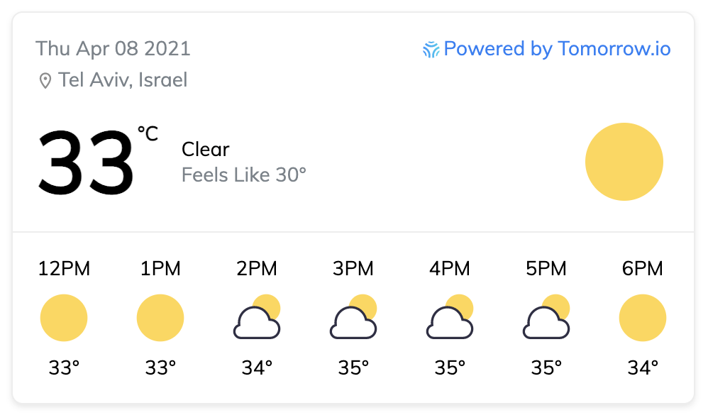

Weather Widget
========

#### Weather Widget using Tomorrow.io API ####
Use our [/timelines endpoint](https://docs.tomorrow.io/reference/timelines-overview) with our [collection of weather icons](https://github.com/Tomorrow-IO-API/tomorrow-weather-codes) to create your very own weather widget.

This project is an updated version of the [previous v3-based widget](https://github.com/nati-levi/climacell-weather-widget), highlighted in [our blog](https://developer.tomorrow.io/blog/how-to-create-a-weather-widget-with-a-weather-api) including a step-by-step explanations on how it's built.

### What's Included ###
Single page React-based weather widget, showing snapshot of today's weather (temperature and weather icon) - including realtime and upcoming 6 hours (in UTC).

> Note: This app uses the key on the clients-side React web app, but it is recommended to secure it by having a proxy backend service calling the Tomorrow.io API. If you want to add local time, use geo-timezone service (such as [geo-tz](https://www.npmjs.com/package/geo-tz)) and the `timezone` request parameter.

### Usage ###
This project was bootstrapped with [Create React App](https://github.com/facebook/create-react-app) - head over to this amazing project to learn more on how to kickoff the work.

To deploy it, we recommend using [Heroku](https://www.heroku.com/), see live demo of previous project example [here](https://climacell-weather-widget.herokuapp.com/?apikey=YOUR_API_KEY&lat=32&lon=34&location=Tel%20Aviv) - (replace YOUR_API_KEY in query with your API key).

### Contributors ###
This project exists thanks to [Nati Levi](https://github.com/nati-levi), our Director of Engineering, and the engineers building the [Tomorrow.io Weather API](https://tomorrow.io).

### License ###
Licensed under the [MIT License](https://opensource.org/licenses/MIT), while the icons in use are according to the [CC BY 4.0 License](./LICENSE.md).